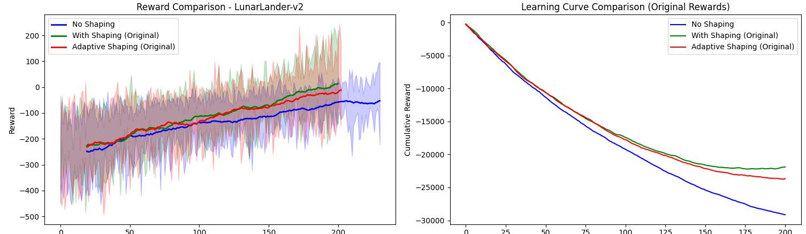

# Wisdom Bootstrapping

trying to implement what I'm terming here wisdom bootstrapping. I've read some interesting papers on reward shaping, none so far on being able to codify 'advice' or wisdom. Atleast nothing  phrased as such. 
Closest thing i found was this paper: https://arxiv.org/pdf/2408.03029 which details self shaping reward, but it's accumulated based on historical buffer afaik. there has to be a way to feed priors without hardcoding the value of the prior, letting the agent learn it. 

## Key Concept

basically do the following: 

1. Leverage useful advice to accelerate learning
2. Gradually discount poor advice as it gains experience
3. Maintain the ability to discover optimal policies that might contradict initial advice

## Methodology

### 2.1 Adaptive Reward Shaping Framework

Given a standard Markov Decision Process (MDP) $\mathcal{M} = (S, A, P, R, \gamma)$, here's an augmented reward function:

$$R'(s, a, s') = R(s, a, s') + \lambda_t f(s, a, s')$$

where:

- $R(s, a, s')$ is the environment's intrinsic reward,
- $f(s, a, s')$ is the shaped reward component derived from external advice,
- $\lambda_t$ is a dynamic scaling factor updated based on observed correlations between $f(s, a, s')$ and actual return $G_t = \sum_{t'} \gamma^{t'-t} R_{t'}$.

### 2.2 Correlation-Based Scaling

At the end of each episode $e$, we track:

- The cumulative original reward $G_e = \sum_t R_t$
- The cumulative shaped component $F_e = \sum_t f_t$

Over a sliding window of $N$ episodes, compute the Pearson correlation coefficient:

$$\rho = \frac{\mathbb{E}[(G - \mu_G)(F - \mu_F)]}{\sigma_G \sigma_F}$$

where $\mu_G, \sigma_G$ are the mean and standard deviation of past $N$ episodic rewards, and $\mu_F, \sigma_F$ are those of the shaped components.

The scaling factor $\lambda_t$ is updated as:

$$\lambda_{t+1} = \max(0, \lambda_t + \eta\rho)$$

where $\eta$ is an adaptation rate.

SO when the advice correlates positively with reward, its influence increases, and when it has no or negative correlation, its influence diminishes.

So that seemed to help, but not well because it's effectively comparing with itself. 

Rather than correlating the shaped component with the reward, let's track whether the agent's performance (measured by cumulative return) is improving over time.

#### Alternative Update Rule

Instead of correlating $\lambda_t$ with the reward shaping component, we track the improvement in expected return over a rolling window:

$$\Delta R_t = \mathbb{E}[G_t] - \mathbb{E}[G_{t-1}]$$

where $G_t$ is the episodic return. We update the shaping factor as:

$$\lambda_{t+1} = \lambda_t + \eta \cdot \text{clip}(\Delta R_t, -\delta, \delta)$$

This approach has several advantages:

- If performance improves ($\Delta R_t > 0$), we increase the shaping factor.
- If performance worsens ($\Delta R_t < 0$), we decrease the shaping factor.
- We clip the update to ensure stability, bounded by parameters $-\delta$ and $\delta$.

This method directly ties the influence of advice to measurable improvements in policy performance, providing a more direct signal for when advice is helpful versus when it might be hindering exploration of better policies.

## Implementation
 `train.py`

 ## Results

The following results demonstrate the effectiveness of Wisdom Bootstrapping across different environments:

### CartPole Environment

### MountainCar Environment

Final Evaluation Summary:
no_shaping: -366.48 ± 0.00
with_shaping: -169.60 ± 0.00
adaptive_shaping: -198.83 ± 0.00